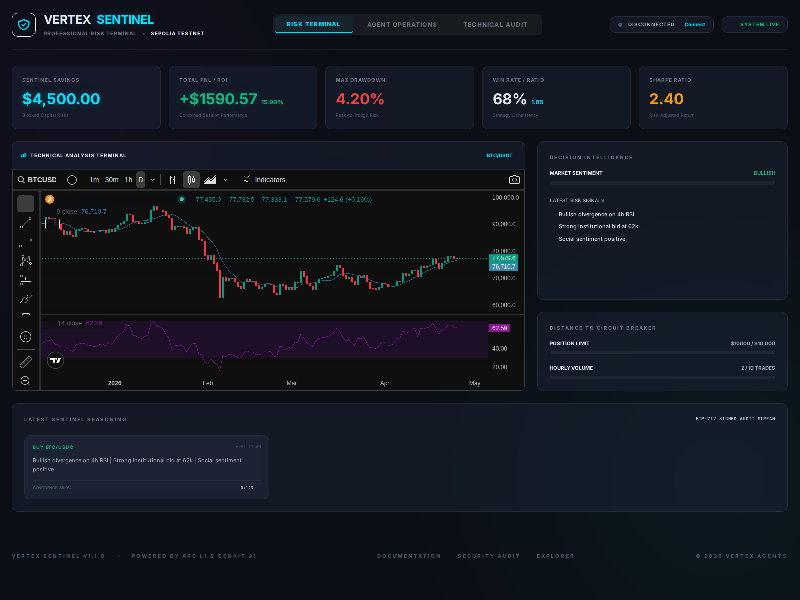
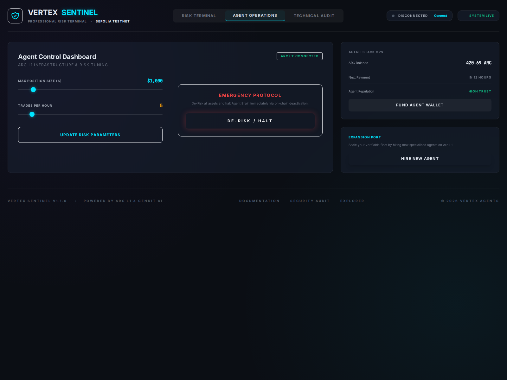
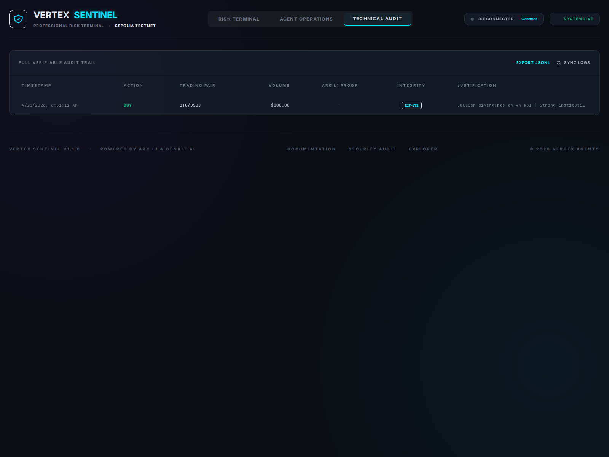

# Monitoring & Alerts - AGENTICAGENT.CHAT

## Dashboard Overview
The AGENTICAGENT.CHAT dashboard provides real-time visibility into the agent's risk assessments, trading activity, and system health.

### Terminal View
Displays the master automation toggle, live PnL, and current risk metrics.

### Operations View
Allows for granular control over risk parameters and fleet management.

### Audit Log
A verifiable trail of all Task Intents and on-chain authorizations.

## Alerts
The system is configured to send alerts via Telegram for critical events, such as high-risk trade detections or AI quota exhaustion.

### Triggered Alert Example
- **Type**: High Risk Alert
- **Description**: Task Intent rejected due to risk score (0.85) exceeding threshold.
- **Trace ID**: `b8122da7-ab49-5b70-802b-ec1067e6dea7`
- **Timestamp**: 2026-05-20T10:00:00Z
