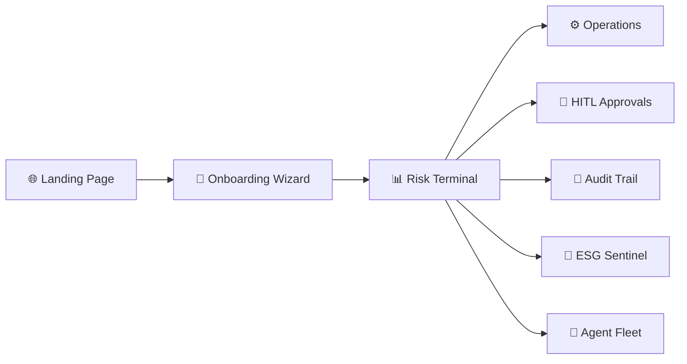
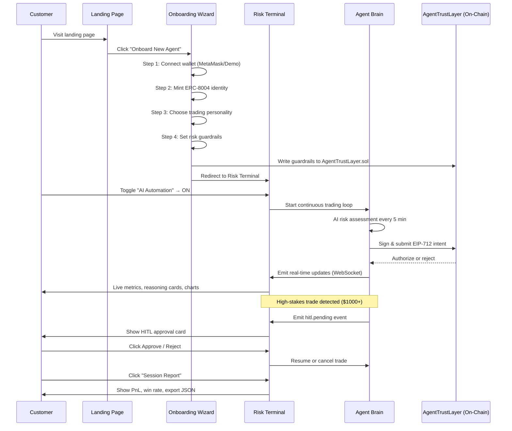

# AGENTICAGENT.CHAT — Customer Navigation & Usage Guide

> A step-by-step walkthrough of how a new customer discovers, onboards, configures, and operates the AGENTICAGENT.CHAT risk management layer for autonomous AI trading agents.

---

## Overview: The Customer Journey

The customer journey has **3 phases**: **Discovery → Onboarding → Active Operations**.

---

## Phase 1: Discovery & First Impression

### Step 1 — Land on the Product Page

**URL:** `http://localhost:3006/landing.html`

The customer arrives at the **AGENTICAGENT.CHAT landing page** — a premium dark-themed hero screen featuring:

- The **AGENTICAGENT.CHAT** brand with a glowing cyan wordmark
- A one-line value proposition: *"The institutional-grade risk management layer for autonomous AI agents. Verifiable, fail-closed, and powered by Arc L1."*
- Three feature pillars: **EIP-712 Integrity**, **Arc L1 Verification**, and **Circle WaaS**
- Two clear CTAs:
  - **"Onboard New Agent"** → starts the onboarding wizard
  - **"Enter Risk Terminal"** → jumps directly to the dashboard (for returning users)

> [!TIP]
> Returning users who have already connected a wallet can skip onboarding entirely and go straight to the Risk Terminal via the second button.

---

## Phase 2: Onboarding Wizard (First-Time Setup)

### Step 2 — Connect Operator Wallet

**URL:** `http://localhost:3006/onboarding`

The onboarding wizard presents a **4-step progress bar** at the top: `Wallet → Identity → Personality → Guardrails`.

**Step 1 of 4: Wallet Connection**

The customer sees a prominent **"Connect MetaMask"** button with a pulsing lock icon.

- **With MetaMask installed:** Clicking the button triggers `eth_requestAccounts`. The wallet connects, and the user's Ethereum address is stored locally.
- **Without MetaMask:** The system automatically activates **Demo Mode**, generating a simulated `0xDEMO...` address so the customer can explore the full product without a real wallet.

> [!NOTE]
> Demo Mode is clearly labeled with an amber banner: *"Demo Mode Active — Simulating Web3 Environment"*. All features remain fully functional for exploration.

### Step 3 — Mint ERC-8004 Identity

**Step 2 of 4: Identity Minting**

After wallet connection, the wizard advances to identity creation:

1. **Enter an Agent Name** (e.g., "Sentinel-Alpha") — a live SVG preview updates in real-time as you type
2. A **gas estimate** and **registration fee** (50 ARC) are displayed
3. The system simulates minting an **ERC-8004 identity NFT** that will serve as the agent's on-chain identity

This identity is registered in the `AgentRegistry.sol` smart contract on Sepolia testnet.

### Step 4 — Choose Agent Personality

**Step 3 of 4: Trading Personality Selection**

The customer selects one of three pre-configured risk profiles:

| Personality | Bias | Risk Tolerance |
|---|---|---|
| **Guardian** | Conservative | Low |
| **Scout** | Balanced | Medium |
| **Predator** | Aggressive | High |

Each personality card shows expected behavior characteristics. Clicking one highlights it with a cyan border.

### Step 5 — Configure Initial Guardrails

**Step 4 of 4: Risk Guardrails**

The final onboarding step lets the customer set initial safety parameters:

- **Max Position Size** — Maximum dollar exposure per trade (e.g., $1,000)
- **Trades Per Hour** — Rate limit for trade execution (e.g., 5 trades/hour)
- **Sentiment Weight** — How much AI sentiment analysis influences decisions (0.0 – 1.0)
- **Liquidity Floor** — Minimum market liquidity required before executing ($10k default)

These parameters are written to the on-chain `AgentTrustLayer.sol` contract and enforced as **hard circuit breakers** — the agent physically cannot exceed them.

After clicking **"Launch Agent"**, the customer is redirected to the main Risk Terminal.

---

## Phase 3: Active Operations — The Risk Terminal

### Step 6 — Dashboard Overview (Risk Terminal Tab)

**URL:** `http://localhost:3006/dashboard` → Default tab: **Risk Terminal**

The Risk Terminal is the customer's command center. It displays:

#### Top Metrics Bar (5 KPIs)

| Metric | Description |
|---|---|
| **Sentinel Savings** | Total capital protected by blocked risky trades (cyan, glowing) |
| **Total PnL / ROI** | Cumulative profit/loss with percentage return |
| **Max Drawdown** | Peak-to-trough risk exposure (crimson) |
| **Win Rate / Ratio** | Strategy consistency as percentage and win/loss ratio |
| **Sharpe Ratio** | Risk-adjusted return measure (amber) |

#### Middle Section

- **TradingView Terminal** (left, 2/3 width) — Live `KRAKEN:BTCUSD` chart with RSI and Moving Average overlays. Customers can change symbols and timeframes.
- **Risk Breakdown Radar** (right, top) — A 5-axis radar chart visualizing: Market Risk, Portfolio Risk, Sentiment Risk, Manual Penalty, AI Score.
- **Market Momentum** (right, middle) — Volatility and Liquidity gauges with a live 10×10 heatmap that pulses with market activity.
- **Distance to Circuit Breaker** (right, bottom) — Progress bars showing how close current activity is to hitting the on-chain guardrails (Position Limit & Hourly Volume).

#### Bottom Section — Latest Sentinel Reasoning

Three cards showing the most recent AI decisions, each containing:
- **Action & Pair** (e.g., "BUY BTC/USDC")
- **AI Reasoning summary**
- **Confidence score**
- **"Deep Dive →"** button to open the full reasoning modal

### Step 7 — Deep Dive into AI Reasoning

Clicking **"Deep Dive →"** on any reasoning card opens a full-screen modal:

1. **Trace ID** — Unique identifier for audit linkage
2. **Market Sentiment** — AI's assessment (Strong Bullish / Neutral / Strong Bearish)
3. **Risk Assessment** — Percentage exposure
4. **Chain of Thought** — Numbered step-by-step AI reasoning process
5. **Final Decision Logic** — Complete decision summary
6. **Verification Badges** — `EIP-712 Signed` and `Arc L1 Verified` stamps
7. **"Download Audit Artifact"** — Export the full decision as a verifiable document

### Step 8 — Enable AI Automation

In the header, the customer sees the **AI Automation toggle** (defaults to OFF).

- **OFF (Default):** The agent brain is idle. The system shows a semi-transparent amber overlay: *"Automation Paused — Manual Override Active — Agent Brain Idle"*
- **ON:** Flipping the toggle sends a `POST /api/automation/toggle` request. The agent brain begins its continuous trading loop:
  - Every 5 minutes (configurable via `TRADING_INTERVAL_MS`), it:
    1. Selects a random pair from BTC/USDC, ETH/USDC, SOL/USDC
    2. Runs AI risk assessment (via GROQ's Llama 3.3 70B)
    3. Signs the Task Intent with EIP-712
    4. Submits to AgentTrustLayer for on-chain validation
    5. Executes on Kraken (or simulates in paper mode)
  - The status indicator changes from amber pulse → emerald: *"System Live"*

> [!IMPORTANT]
> Automation defaults strictly to **OFF**. The customer must explicitly opt in. This is a core safety invariant of the Fail-Closed architecture.

### Step 9 — Connect Your Wallet (Dashboard)

The header also has a **"Connect Wallet"** button:

- Clicking connects MetaMask (or enters Demo Mode if unavailable)
- Once connected, the button is replaced with a green dot and truncated address (e.g., `0x5367...FdBC`)
- Network badge shows `Sepolia Testnet` or `DEMO MODE`

### Step 10 — View Session Report

Clicking the **"Session Report"** button opens a purple-themed modal showing:

- **Realized PnL** — Total profit/loss from closed trades
- **Win Rate** — Percentage of profitable trades
- **Max Drawdown** — Worst peak-to-trough decline
- **Sentinel Saved** — Capital protected by blocked trades
- **Trade History Table** — Timestamped list of every trade with pair, side, price, and individual PnL
- **"Export Report (.JSON)"** — Downloads the full session data

---

## Phase 3b: Advanced Operations Tabs

### Step 11 — Operations Tab (⚙️)

Navigate via the sidebar gear icon. This tab provides:

#### Agent Control Dashboard
- **Max Position Size slider** ($100 – $10,000)
- **Trades Per Hour slider** (1 – 50)
- **Sentiment Weight slider** (0.0 – 1.0)
- **Liquidity Floor slider** ($1k – $100k)
- **"Update Risk Parameters"** button — Writes new parameters to the on-chain AgentTrustLayer
- **Manual Guardrail Pin toggle** — Locks parameters to prevent automated recalibration

#### Emergency Protocol
A prominent red **"DE-RISK / HALT"** button that:
1. De-risks all open positions
2. Halts the Agent Brain immediately
3. Writes a `logs/HALTED` file requiring manual intervention to restart

#### Agent Stack Ops (Sidebar)
- **ARC Balance** — Current Arc L1 token balance
- **Next Payment** — Upcoming payroll for agent compute
- **Agent Reputation** — Trust score from validator attestations
- **"Fund Agent Wallet"** button

#### Expansion Port
- **"Hire New Agent"** button — Opens a modal to deploy additional specialized agents

### Step 12 — HITL Approval Tab (🔔)

Navigate via the sidebar bell icon. This tab handles **Human-in-the-Loop** verification:

- When a trade exceeds the **HITL threshold** (default: $1,000 USD), the agent brain **pauses execution** and emits a `hitl.pending` event
- A notification badge pulses on the sidebar icon
- The pending trade appears as an amber-bordered card showing:
  - **Action & Pair** (e.g., "BUY ETH/USDC — $1,250.00")
  - **AI Reasoning** for why this trade was proposed
  - **Trace ID** for audit linkage
- Two action buttons:
  - **✅ Approve** — Resumes execution, signs the intent, and sends it on-chain
  - **❌ Reject** — Cancels the trade and logs the rejection reason

> [!WARNING]
> If no action is taken within **10 minutes**, the trade is automatically rejected with reason: *"HITL approval timed out"*. This enforces the fail-closed safety guarantee.

### Step 13 — Audit Trail Tab (📝)

Navigate via the sidebar document icon. This tab shows:

- **Full Verifiable Audit Trail** — A table with columns:
  - **Timestamp** — When the decision occurred
  - **Action** — BUY / SELL / HOLD (color-coded)
  - **Trading Pair** — e.g., BTC/USDC
  - **Volume** — Trade size in USD
  - **Arc L1 Proof** — Clickable link to Sepolia Etherscan transaction
  - **Integrity** — `EIP-712` badge confirming cryptographic signature
  - **Justification** — AI reasoning summary (hover for full text)
- **"Export JSONL"** button — Downloads the complete audit log for compliance

Every row in this table is backed by an EIP-712 signed checkpoint stored in `logs/audit.json`.

### Step 14 — ESG Sentinel Tab (💚)

Navigate via the sidebar heart icon. This tab displays sustainability metrics:

- **Energy Efficiency** — 94.2% Renewable Energy Compute Index
- **Carbon Offset Proof** — 12.4t Verifiable CO2e Neutralized
- **Social Impact Score** — A+ Governance & Inclusion Metrics
- **ESG Scoring Breakdown** — Progress bars for Environmental (92/100), Social (88/100), Governance (98/100)
- **ESG Tier Badge** — "Platinum"
- **"Download ESG Audit Report"** — For institutional compliance reporting

### Step 15 — Agent Fleet Tab (👥)

Navigate via the sidebar people icon. This tab manages multi-agent operations:

#### Fleet Metrics
| Metric | Value |
|---|---|
| Active Agents | 1 |
| Fleet ROI (24h) | +3.12% |
| ARC Stake | 1,250 |
| Resource Usage | 12% |

#### Agent Management
- List of active agents with **Mode**, **Uptime**, and **PnL** for each
- **"Config"** and **"Halt"** buttons per agent
- **"Hire New Agent"** button opens a modal to deploy:
  1. Select agent model (Guardian / Scout / Predator)
  2. Set initial ARC allocation
  3. Review gas estimate and registration fee
  4. Confirm hiring

#### Payroll & ARC
- Current ARC balance with Deposit button
- Pending invoices for compute operations
- Billing history

---

## Quick Reference: System Lifecycle Commands

| Action | Command |
|---|---|
| **Start the system** | `./start-app.sh` |
| **Stop the system** | `./stop-app.sh` |
| **Monitor logs** | `tail -f logs/sentinel.log` |
| **Access dashboard** | `http://localhost:3006/dashboard` |
| **Force restart from HALT** | `npm start -- --force-restart` |
| **Check process status** | `ps -p $(cat pids/sentinel.pid)` |

---

## Summary: Complete User Flow

